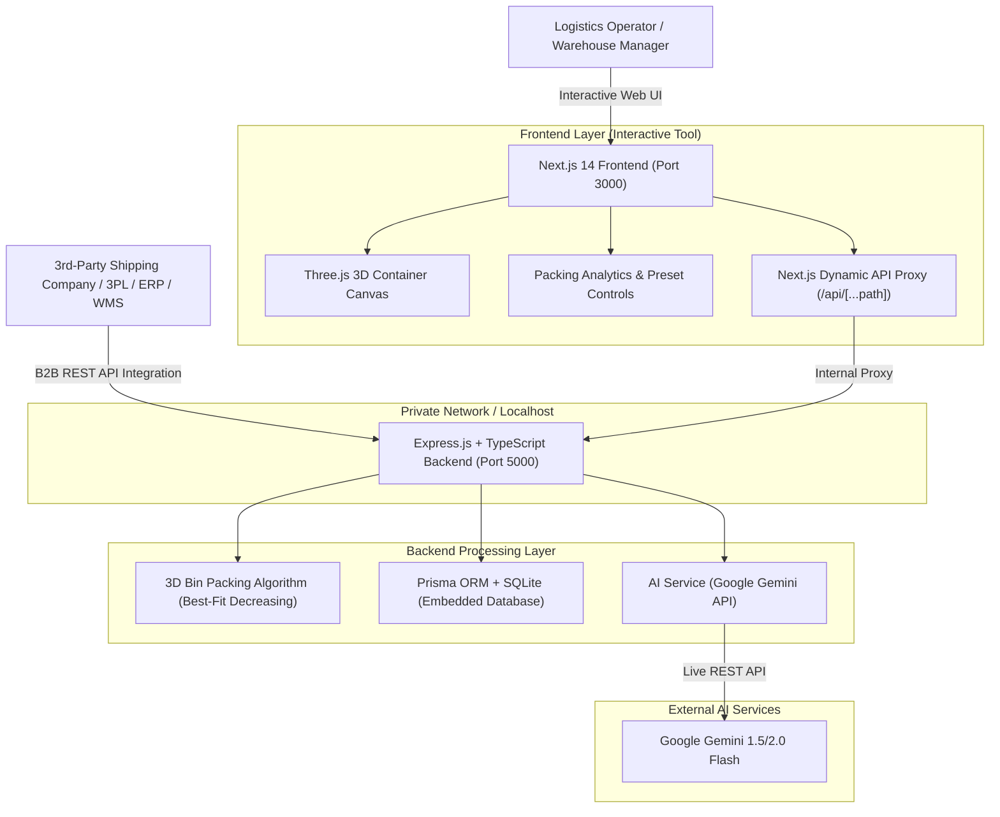

# 📦 PackAI — AI-Assisted 3D Container & Pallet Packing Optimizer

[](https://nextjs.org/)
[](https://react.js.org/)
[](https://threejs.org/)
[](https://www.typescriptlang.org/)
[](https://expressjs.com/)
[](https://www.prisma.io/)
[](https://ai.google.dev/)
[](https://zerops.io/)

**PackAI** is an industrial-grade, AI-assisted 3D container packing and spatial layout optimization platform designed for the global shipping, freight forwarding, warehousing, and supply chain industries.

Built with a **dual-delivery architecture**, PackAI serves both as an **interactive operational tool** for warehouse teams and as a **headless B2B REST API** that third-party shipping companies, 3PL providers, and enterprise systems (ERP/WMS) can integrate directly into their automated logistics pipelines.

---

## 🎯 Purpose & Dual-Use Industry Value

In global ocean freight, air cargo, and land transport, **shipping empty container space costs billions annually**:
* **Container Underutilization**: Up to 25% of standard container volume is lost due to manual guesswork and sub-optimal stacking.
* **Cargo Damage & Safety Violations**: Sub-optimal weight distribution, improper center of gravity, and heavy-on-fragile stacking lead to expensive in-transit cargo damage and axle-load compliance fines.
* **Operational Inefficiencies**: Dispatchers and warehouse loading crews spend hours calculating multi-SKU carton arrangements manually.

### 🏢 1. As an Internal Operational Tool (For Logistics & Warehouse Teams)
* **Interactive 3D Simulation**: Loading crews and planners can visually simulate container packing in real-time WebGL 3D before a single carton is physically moved.
* **Layer-by-Layer Stacking Guidance**: Provides visual step-by-step loading plans, reducing loading dock turnaround times.
* **AI-Powered Safety & Cost Analysis**: Evaluates center of gravity, fragile item placement, and estimates container freight savings using Google Gemini Generative AI.

### 🔌 2. As an Embeddable REST API (For External Shipping Companies & 3PLs)
* **WMS / ERP Integration**: Seamlessly connects into existing systems (SAP, Oracle SCM, Manhattan Associates, Blue Yonder) via standard JSON endpoints.
* **Automated Freight Quoting**: Shipping platforms and e-commerce checkouts can programmatically calculate the exact number and size of containers needed for bulk orders.
* **Multi-Tenant / Headless Automation**: Batch-process thousands of shipment manifests per hour to auto-assign optimal container types and calculate cubic utilization scores.

---

## 🏗️ Architecture Overview



---

## 💻 Tech Stack

| Component | Technology | Purpose |
| :--- | :--- | :--- |
| **Frontend Framework** | Next.js 14 (App Router) | High-performance React framework with server-side rendering and dynamic proxy routing |
| **UI & Styling** | Tailwind CSS + Lucide Icons | Responsive, modern dark-themed industrial user interface |
| **3D Rendering Engine** | Three.js | Real-time WebGL interactive 3D container visualization with orbit controls |
| **Backend API** | Node.js + Express.js + TypeScript | High-throughput REST API for packing computation and data persistence |
| **Packing Algorithm** | Custom 3D Best-Fit Decreasing | Multi-axis rotation, collision boundary detection, volume optimization |
| **Database & ORM** | Prisma ORM + Embedded SQLite | Zero-dependency persistence for container presets and optimization logs |
| **Generative AI** | Google Gemini API (`gemini-flash-latest`) | Live operational logistics reasoning, center-of-gravity advice, and cost impact estimation |
| **Cloud Deployment** | Zerops Cloud Platform | Automated CI/CD pipeline via `zerops.yml` with private inter-service networking |

---

## ✨ Key Features

* 📦 **Standard & Custom Containers**: Pre-configured with ISO shipping containers (20ft Standard, 40ft High Cube, Euro Pallets, US Standard Pallets) + custom dimensional input.
* 📐 **Mixed-Dimension Package Loading**: Support for multi-sku cargo with custom lengths, widths, heights, quantities, and weights.
* 🎮 **Interactive 3D Visualizer**:
  * 360° Orbit, Pan, and Zoom controls.
  * Transparent container wireframe with dimensional bounds.
  * Individual package inspection tooltips and layer filters.
* 🤖 **Live Google Gemini AI Analysis**:
  * Actionable step-by-step loading sequence guidance.
  * Heavy-to-light weight balance assessment.
  * Fragile carton protection guidelines.
  * Estimated operational freight savings.
* 📊 **Instant Operational Metrics**:
  * Total Volume Utilization (`%`).
  * Empty Space Percentage (`%`).
  * Total Packed Items vs. Total Weight.
* 📜 **Optimization History**: Automatically persists historical packing runs for auditing and operational review.

---

## 🚀 Getting Started (Local Development)

### Prerequisites
* **Node.js**: v18+ or v20+
* **Git**

### 1. Clone the Repository
```bash
git clone https://github.com/chandan916/PackAI.git
cd PackAI
```

### 2. Backend Setup
```bash
cd packai/backend
npm install
npx prisma generate
```

Create a `.env` file in `packai/backend/`:
```env
PORT=5000
DATABASE_URL="file:./dev.db"
GEMINI_API_KEY=your_google_gemini_api_key_here
```

Start the backend server:
```bash
npm run dev
```
Backend API will be live at `http://localhost:5000`.

### 3. Frontend Setup
In a new terminal:
```bash
cd packai/frontend
npm install
npm run dev
```
Frontend application will be live at `http://localhost:3000`.

---

## ⚡ One-Click Windows Quick Launch

If you are on Windows, simply double-click **`start-packai.bat`** in the root folder to automatically launch both the backend and frontend servers simultaneously!

---

## ☁️ Deployment on Zerops

PackAI is pre-configured for seamless cloud deployment on [Zerops](https://zerops.io) using [`zerops.yml`](./zerops.yml).

### Deployment Architecture on Zerops
1. **Backend Service (`setup: backend`)**:
   * Runs Node.js 20 on Ubuntu.
   * Compiles TypeScript and automatically initializes the SQLite schema on startup.
   * Internal endpoint: `http://backend:5000`.
2. **Frontend Service (`setup: frontend`)**:
   * Runs Next.js 14 on Node.js 20.
   * Proxies `/api/*` requests internally to `http://backend:5000` via dynamic App Router proxy.
   * Public HTTP/HTTPS port: `3000`.

### Deploy in 3 Steps:
1. Push this repository to GitHub.
2. In the Zerops Dashboard, import [`zerops-import.yaml`](./zerops-import.yaml).
3. Under the `backend` service in Zerops, add your `GEMINI_API_KEY` under **Environment Variables & Secrets**.

---

## 📡 REST API Reference

### `POST /api/optimize`
Runs the 3D packing algorithm and queries Gemini AI for operational recommendations.
* **Payload**:
  ```json
  {
    "container": { "name": "20ft Container", "length": 590, "width": 235, "height": 239 },
    "packages": [
      { "name": "Heavy Machinery Box", "length": 120, "width": 80, "height": 60, "quantity": 10, "weight": 45 },
      { "name": "Electronics Carton", "length": 60, "width": 40, "height": 40, "quantity": 25, "weight": 8 }
    ],
    "useAI": true
  }
  ```

### `GET /api/presets`
Returns all default container and package presets.

### `GET /api/optimizations`
Returns historical packing runs with performance metrics.

---

## 📄 License
This project is built for hackathons, supply-chain research, and commercial logistics optimization. Released under the **MIT License**.
